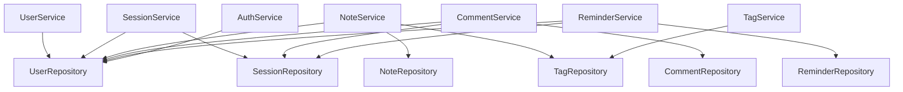

# AcadeMeet Backend Class Diagram & Relationships

_Generated: November 27, 2025_  
_Repository: AcadeMeet_  
_Branch: main_

## 🏗️ Architecture Overview

The AcadeMeet backend follows a **layered Spring Boot architecture** with clear separation of concerns:

- **Controller Layer** → REST endpoints and request handling
- **Service Layer** → Business logic and transactions
- **Repository Layer** → Data access abstraction
- **Model Layer** → Entity definitions and database mapping

---

## 📊 System Statistics

| Category          | Count | Description                                                |
| ----------------- | ----- | ---------------------------------------------------------- |
| **Core Entities** | 7     | User, Session, Note, Comment, Reminder, Tag, UserSavedNote |
| **Enums**         | 5     | Type safety for statuses and types                         |
| **DTOs**          | 11    | Request/response data transfer objects                     |
| **Repositories**  | 7     | JPA data access interfaces                                 |
| **Services**      | 7     | Business logic services                                    |
| **Controllers**   | 7     | REST API controllers                                       |

---

## 🎯 Core Entities & Attributes

### **User Entity**

```java
@Entity
@Table(name = "user")
public class User {
    @Id @GeneratedValue
    private Long id;                        // Primary Key

    // Profile Information
    private String name;                    // Full name
    private String email;                   // Unique email
    private String password;                // Hashed password
    private String program;                 // Academic program
    private Integer yearLevel;              // Year level
    private String school;                  // School name
    private String phoneNumber;             // Contact number
    private String bio;                     // Profile bio

    // Media
    private String profileImageUrl;         // Profile picture
    private String coverImageUrl;           // Cover image

    // Timestamps
    private LocalDateTime createdAt;        // Account creation

    // Relationships
    @OneToMany(mappedBy = "user")
    private Set<UserSavedNote> savedNotes;  // Saved notes collection
}
```

### **Session Entity**

```java
@Entity
@Table(name = "sessions")
public class Session {
    @Id @GeneratedValue
    private Long id;                        // Primary Key

    // Basic Information
    private String title;                   // Session title
    private String description;             // Session description
    private String location;                // Meeting location

    // Date & Time (stored as strings for flexibility)
    private String month;                   // "November", "December"
    private String day;                     // "1", "15", "31"
    private String year;                    // "2024", "2025"
    private LocalTime startTime;            // 24-hour format
    private LocalTime endTime;              // 24-hour format

    // Host Relationship
    @ManyToOne(fetch = FetchType.LAZY)
    @JoinColumn(name = "host_id_fk", referencedColumnName = "user_id")
    private User host;                      // Session creator

    // Privacy & Access Control
    private SessionType sessionType;        // PUBLIC, PRIVATE
    private String password;                // For private sessions
    private SessionStatus status;           // ACTIVE, COMPLETED, DELETED, CANCELLED

    // Participant Management
    private Integer maxParticipants;        // Maximum allowed
    private Integer currentParticipants;    // Current count

    // Media
    private String profileImageUrl;         // Session thumbnail
    private String coverImageUrl;           // Session cover

    // Timestamps
    private LocalDateTime createdAt;
    private LocalDateTime updatedAt;
}
```

### **Note Entity**

```java
@Entity
@Table(name = "note")
public class Note {
    @Id @GeneratedValue
    private Long id;                        // Primary Key

    // Basic Information
    private String title;                   // Note title
    private String content;                 // Note content (LONGTEXT)
    private String filePath;                // For FILE type notes

    // Type & Status
    private NoteType type;                  // FILE, RICHTEXT
    private NoteStatus status;              // ACTIVE, ARCHIVED, TRASH

    // Owner Relationship
    @ManyToOne
    @JoinColumn(name = "owner_user_id", referencedColumnName = "user_id")
    private User owner;                     // Note creator

    // Many-to-Many Relationships
    @ManyToMany
    @JoinTable(name = "note_tags",
        joinColumns = @JoinColumn(name = "note_id"),
        inverseJoinColumns = @JoinColumn(name = "tag_id"))
    private Set<Tag> tags;                  // Associated tags

    @OneToMany(mappedBy = "note")
    private Set<UserSavedNote> savedByUsers; // Users who saved this note

    // Timestamps
    private LocalDateTime createdAt;
    private LocalDateTime updatedAt;
}
```

### **Comment Entity**

```java
@Entity
@Table(name = "comments")
public class Comment {
    @Id @GeneratedValue
    private Long commentId;                 // Primary Key

    // Content
    private String content;                 // Comment text

    // Relationships
    @ManyToOne(fetch = FetchType.LAZY)
    @JoinColumn(name = "session_id")
    private Session session;                // Associated session

    @ManyToOne(fetch = FetchType.LAZY)
    @JoinColumn(name = "user_id")
    private User user;                      // Comment author

    // Hierarchical Structure (Self-referencing)
    @ManyToOne(fetch = FetchType.LAZY)
    @JoinColumn(name = "parent_comment_id")
    private Comment parentComment;          // Parent for replies

    @OneToMany(mappedBy = "parentComment")
    private List<Comment> replies;          // Child replies

    // Metadata
    private boolean isEdited;               // Edit flag
    private Integer replyCount;             // Number of replies

    // Timestamps
    private LocalDateTime createdAt;
    private LocalDateTime updatedAt;
}
```

### **Reminder Entity**

```java
@Entity
@Table(name = "reminders")
public class Reminder {
    @Id @GeneratedValue
    private Long reminderId;                // Primary Key

    // Reminder Content
    private String reminderMessage;         // Custom message
    private LocalDateTime reminderTime;     // When to trigger

    // Relationships
    @ManyToOne(fetch = FetchType.LAZY)
    @JoinColumn(name = "user_id")
    private User user;                      // Reminder owner

    @ManyToOne(fetch = FetchType.LAZY)
    @JoinColumn(name = "session_id")
    private Session session;                // Associated session

    // Notification Settings
    private NotificationType notificationType; // IN_APP, EMAIL, BOTH
    private boolean isSent;                 // Delivery status
    private LocalDateTime sentAt;           // When sent

    // Timestamps
    private LocalDateTime createdAt;
}
```

### **Tag Entity**

```java
@Entity
@Table(name = "tag")
public class Tag {
    @Id @GeneratedValue
    private Long tagId;                     // Primary Key

    private String name;                    // Tag name (unique)
}
```

### **UserSavedNote Entity (Junction Table)**

```java
@Entity
@Table(name = "user_saved_notes")
public class UserSavedNote {
    @Id @GeneratedValue
    private Long id;                        // Primary Key

    // Relationships
    @ManyToOne(fetch = FetchType.LAZY)
    @JoinColumn(name = "user_id")
    private User user;                      // User who saved

    @ManyToOne(fetch = FetchType.LAZY)
    @JoinColumn(name = "note_id")
    private Note note;                      // Saved note

    // Timestamp
    private LocalDateTime savedAt;          // When saved
}
```

---

## 🔗 Entity Relationships Detailed

### **1. User-Centric Relationships**

#### **User → Session (One-to-Many)**

- **Relationship**: User hosts multiple sessions
- **Foreign Key**: `sessions.host_id_fk` → `user.user_id`
- **Cardinality**: 1 User : N Sessions
- **Business Logic**: Each session has exactly one host, user can host multiple sessions
- **Cascade**: When user is deleted, sessions remain but host reference may be nullified

#### **User → Note (One-to-Many)**

- **Relationship**: User owns multiple notes
- **Foreign Key**: `note.owner_user_id` → `user.user_id`
- **Cardinality**: 1 User : N Notes
- **Business Logic**: Each note has exactly one owner, user can create multiple notes
- **Cascade**: When user is deleted, their notes are typically deleted (orphanRemoval)

#### **User → Comment (One-to-Many)**

- **Relationship**: User creates multiple comments
- **Foreign Key**: `comments.user_id` → `user.user_id`
- **Cardinality**: 1 User : N Comments
- **Business Logic**: Each comment has exactly one author, user can comment multiple times
- **Cascade**: When user is deleted, their comments may be deleted or marked as anonymous

#### **User → Reminder (One-to-Many)**

- **Relationship**: User sets multiple reminders
- **Foreign Key**: `reminders.user_id` → `user.user_id`
- **Cardinality**: 1 User : N Reminders
- **Business Logic**: Each reminder belongs to exactly one user
- **Cascade**: When user is deleted, their reminders are deleted

#### **User ↔ Note (Many-to-Many via UserSavedNote)**

- **Relationship**: User saves multiple notes, note can be saved by multiple users
- **Junction Table**: `user_saved_notes`
- **Foreign Keys**:
  - `user_saved_notes.user_id` → `user.user_id`
  - `user_saved_notes.note_id` → `note.note_id`
- **Cardinality**: M User : N Notes
- **Business Logic**: Bookmarking/favoriting system
- **Additional Data**: `savedAt` timestamp in junction table

### **2. Session-Centric Relationships**

#### **Session → Comment (One-to-Many)**

- **Relationship**: Session contains multiple comments
- **Foreign Key**: `comments.session_id` → `sessions.id`
- **Cardinality**: 1 Session : N Comments
- **Business Logic**: Comments are discussions about specific sessions
- **Cascade**: When session is deleted, comments are typically deleted

#### **Session → Reminder (One-to-Many)**

- **Relationship**: Session triggers multiple reminders
- **Foreign Key**: `reminders.session_id` → `sessions.id`
- **Cardinality**: 1 Session : N Reminders
- **Business Logic**: Users set reminders for specific sessions
- **Cascade**: When session is deleted, related reminders are deleted

### **3. Comment Hierarchical Relationship**

#### **Comment → Comment (One-to-Many Self-Reference)**

- **Relationship**: Comment can have multiple reply comments
- **Foreign Key**: `comments.parent_comment_id` → `comments.comment_id`
- **Cardinality**: 1 Parent Comment : N Reply Comments
- **Business Logic**: Nested comment threads/discussions
- **Special Features**:
  - `replyCount` field maintains count of direct replies
  - `isEdited` flag tracks modification status

### **4. Note-Tag Relationship**

#### **Note ↔ Tag (Many-to-Many)**

- **Relationship**: Note can have multiple tags, tag can be applied to multiple notes
- **Junction Table**: `note_tags`
- **Foreign Keys**:
  - `note_tags.note_id` → `note.note_id`
  - `note_tags.tag_id` → `tag.tag_id`
- **Cardinality**: M Notes : N Tags
- **Business Logic**: Categorization and filtering system
- **Unique Constraint**: Tags have unique names

---

## 📝 Enumerations & Types

### **SessionType**

```java
public enum SessionType {
    PUBLIC,     // Open to all users
    PRIVATE     // Requires password
}
```

### **SessionStatus**

```java
public enum SessionStatus {
    ACTIVE,     // Currently available
    COMPLETED,  // Finished session
    DELETED,    // Soft deleted
    CANCELLED   // Cancelled before completion
}
```

### **NoteType**

```java
public enum NoteType {
    FILE,       // File-based note
    RICHTEXT    // Rich text editor content
}
```

### **NoteStatus**

```java
public enum NoteStatus {
    ACTIVE,     // Normal state
    ARCHIVED,   // Archived but accessible
    TRASH       // Soft deleted
}
```

### **NotificationType**

```java
public enum NotificationType {
    IN_APP,     // Application notification only
    EMAIL,      // Email notification only
    BOTH        // Both in-app and email
}
```

---

## 🛠️ Service Layer Architecture

### **Service Dependencies**



### **Cross-Service Dependencies**

1. **SessionService** depends on **UserRepository** for host validation
2. **NoteService** depends on **TagRepository** for tag management
3. **CommentService** depends on **SessionRepository** and **UserRepository**
4. **ReminderService** depends on both **UserRepository** and **SessionRepository**

---

## 🎮 Controller-Service Mapping

| Controller             | Primary Service | Additional Dependencies           |
| ---------------------- | --------------- | --------------------------------- |
| **AuthController**     | AuthService     | UserRepository                    |
| **UserController**     | UserService     | -                                 |
| **SessionController**  | SessionService  | UserRepository                    |
| **NoteController**     | NoteService     | TagRepository, UserRepository     |
| **CommentController**  | CommentService  | SessionRepository, UserRepository |
| **ReminderController** | ReminderService | UserRepository, SessionRepository |
| **TagController**      | TagService      | -                                 |

---

## 📊 Data Transfer Objects (DTOs)

### **Request DTOs**

- **LoginRequest** - Authentication credentials
- **SignupRequest** - User registration data
- **NoteRequest** - Note creation/update data
- **CommentRequest** - Comment creation data
- **ReminderRequest** - Reminder creation data
- **JoinSessionRequest** - Session joining (with password)
- **UpdateStatusRequest** - Status change requests
- **UpdateProfileRequest** - Profile update data
- **ChangePasswordRequest** - Password change data

### **Response DTOs**

- **SessionDTO** - Session data with host information
- **AuthResponse** - Authentication response with user data

---

## 🔒 Security & Data Integrity

### **Authentication Flow**

1. **AuthController** receives login/signup requests
2. **AuthService** validates credentials and hashes passwords
3. **UserRepository** handles user persistence
4. **AuthResponse** returns user data and session info

### **Data Integrity Measures**

- **Foreign Key Constraints** on all relationships
- **Unique Constraints** on email (User) and name (Tag)
- **Enumerated Types** for controlled vocabularies
- **Password Hashing** in AuthService
- **Cascade Operations** for dependent data cleanup

### **Soft Delete Pattern**

- **Sessions**: Use `SessionStatus.DELETED`
- **Notes**: Use `NoteStatus.TRASH`
- **Comments**: May implement soft delete or hard delete depending on requirements

---

## 🚀 API Endpoint Structure

### **RESTful Endpoint Patterns**

| Entity        | Base Path        | Key Endpoints                                                     |
| ------------- | ---------------- | ----------------------------------------------------------------- |
| **Auth**      | `/api/auth`      | `POST /login`, `POST /signup`                                     |
| **Users**     | `/api/users`     | `GET /{id}`, `PUT /{id}`, `DELETE /{id}`                          |
| **Sessions**  | `/api/sessions`  | `GET /`, `POST /`, `GET /{id}`, `PUT /{id}`, `DELETE /{id}`       |
| **Notes**     | `/api/notes`     | `GET /`, `POST /`, `GET /{id}`, `PUT /{id}`, `DELETE /{id}`       |
| **Comments**  | `/api/comments`  | `GET /session/{sessionId}`, `POST /`, `PUT /{id}`, `DELETE /{id}` |
| **Reminders** | `/api/reminders` | `GET /user/{userId}`, `POST /`, `PUT /{id}`, `DELETE /{id}`       |
| **Tags**      | `/api/tags`      | `GET /`, `POST /`, `DELETE /{id}`                                 |

### **Special Endpoints**

- **Sessions**: `GET /api/sessions/by-date?year={year}&month={month}&day={day}` - Calendar integration
- **Sessions**: `POST /api/sessions/{id}/join` - Join session with password
- **Sessions**: `POST /api/sessions/{id}/validate-password` - Password validation
- **Sessions**: `POST /api/sessions/{id}/upload-image` - Image upload
- **Notes**: `GET /api/notes/search?query={query}` - Note search
- **Users**: `POST /api/users/{id}/upload-profile-image` - Profile image upload

---

## 🎯 Key Design Patterns

### **Repository Pattern**

- **Interfaces**: All repositories extend `JpaRepository<Entity, ID>`
- **Custom Queries**: Method name-based queries and `@Query` annotations
- **Separation**: Clear separation between data access and business logic

### **Service Pattern**

- **Business Logic**: All business rules contained in service layer
- **Transaction Management**: `@Transactional` annotations for data consistency
- **Dependency Injection**: `@Autowired` for repository dependencies

### **DTO Pattern**

- **Data Transfer**: Clean separation between internal models and API contracts
- **Validation**: Input validation through DTOs
- **Transformation**: Entity-to-DTO mapping in service layer

### **Enum Pattern**

- **Type Safety**: Controlled vocabularies for statuses and types
- **Database Storage**: `@Enumerated(EnumType.STRING)` for readability

---

## 📈 Scalability Considerations

### **Database Design**

- **Indexes**: Primary keys and foreign keys are automatically indexed
- **Lazy Loading**: `FetchType.LAZY` on relationships to prevent N+1 queries
- **Cascade Operations**: Careful cascade configuration to prevent unintended deletions

### **Service Architecture**

- **Stateless Services**: All services are stateless for horizontal scaling
- **Repository Abstraction**: Easy to switch between different data sources
- **DTO Usage**: Prevents entity exposure and allows API versioning

### **Performance Features**

- **Pagination Support**: Repository methods can be extended with `Pageable`
- **Query Optimization**: Custom queries for complex operations
- **Caching Potential**: Services designed to support caching layers

This comprehensive backend architecture provides a solid foundation for the AcadeMeet application with clear relationships, proper separation of concerns, and scalability considerations.
